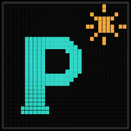
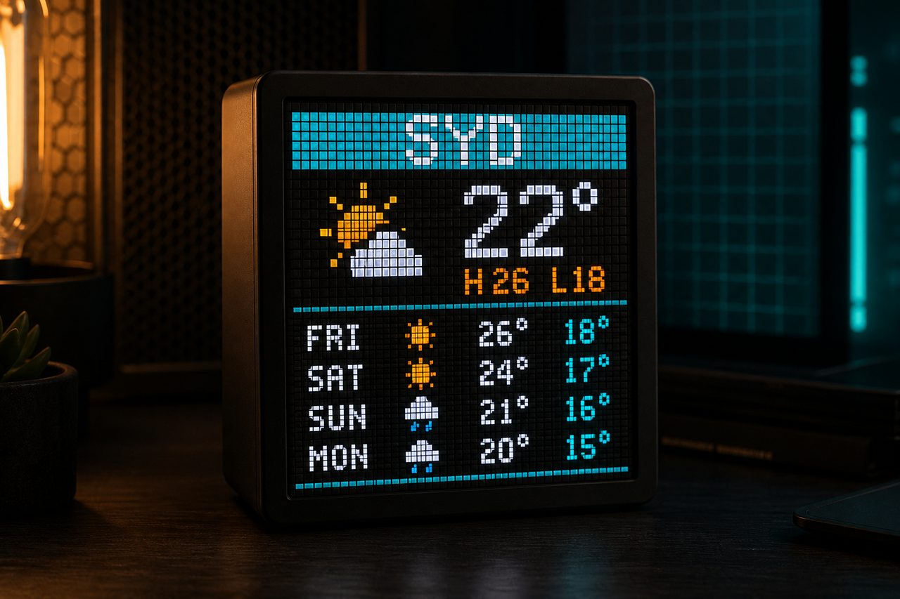
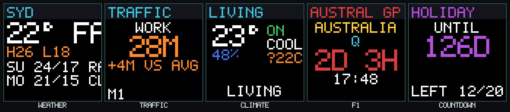
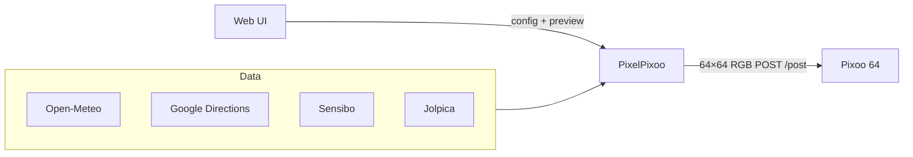

# PixelPixoo

<p align="center">
  
</p>

<p align="center">
  <a href="https://www.python.org/"></a>
  <a href="LICENSE"></a>
  <a href="docker-compose.yml"></a>
</p>

Push-loop dashboard for a [Divoom Pixoo 64](https://divoom.com/products/pixoo-64) — weather, commute times, climate, F1, countdowns, and more — with a built-in web UI.

Frames are rendered as 64×64 RGB and POSTed to the device on your LAN. No cloud middleman for the display path.

<p align="center">
  
</p>

## Features

| Screen | Source | API key |
|--------|--------|---------|
| Weather + multi-day forecast | [Open-Meteo](https://open-meteo.com/) | No |
| Traffic / commute ETA | [Google Directions](https://developers.google.com/maps/documentation/directions) | Yes (`GOOGLE_MAPS_API_KEY`) |
| Sensibo room climate | [Sensibo API](https://sensibo.github.io/) | Yes (`SENSIBO_API_KEY`) |
| Next F1 session | [Jolpica](https://api.jolpi.ca/) (Ergast-compatible) | No |
| Countdown | Config dates | No |
| Bin night | Weekly / fortnightly schedule | No (conditional tile) |

<p align="center">
  
</p>

Also included:

- Custom multi-tile layouts on a single 64×64 frame (`row_pattern`, tile picker)
- Tiny / compact / normal text scales for dense dashboards
- Crossfade between frames, brightness + rotate interval
- Optional on/off schedule (timezone-aware windows, sunrise/sunset, Sensibo presence)
- Per-feature enable switches (Sensibo, Traffic, F1, …) — off stops API calls and drops the screen, settings stay saved
- Config web UI with live previews, secret masking, export/import
- Docker + Portainer-friendly deploy (named volumes; no secrets in git)

## How it fits together



Display path is LAN-only: the loop paints frames with Pillow, then POSTs them to the Pixoo. External APIs (Open-Meteo, Google, Sensibo, Jolpica) are only used for screen content. Optional same-LAN discovery is the exception — it asks Divoom’s cloud which devices share this public IP.

## Quick start

### Requirements

- Docker (recommended), or Python **3.11+**
- A Pixoo 64 reachable on your LAN (for live push)
- Optional: Google Maps + Sensibo API keys for those screens

### Docker (local)

```bash
git clone https://github.com/AlexWHughes/PixelPixoo.git
cd PixelPixoo

cp .env.example .env
# Edit .env — at least PIXOO_IP. Add API keys as needed.

docker compose up --build -d
open http://localhost:8787
```

Compose uses named volumes. On first boot the entrypoint seeds `config.example.yaml` into the config volume; finish lat/lon and tiles in the web UI.

### Docker (named volumes — Portainer / GitHub)

Use `docker-compose.yml` alone. On first boot the entrypoint seeds `config.example.yaml` into the `pixelpixoo_config` volume.

1. Deploy the stack from this repository.
2. Set environment variables in the UI (or Compose):
   - `PIXOO_IP` (required for live push)
   - `GOOGLE_MAPS_API_KEY` (traffic)
   - `SENSIBO_API_KEY` (Sensibo)
   - `PIXELPIXOO_WEB_PORT=8787` (optional host port)
3. Open the web UI and finish setup (tiles, routes, devices).
4. Use **Export** / **Import** to back up or move a full config (includes secrets — treat the file carefully).

Default Compose uses **bridge** networking (published web port only). If the container cannot reach the Pixoo on your LAN that way, switch to **host** networking: uncomment `network_mode: host` in Compose and drop the `ports:` mapping (host mode binds the container’s ports directly on the host).

### Preview mode (no device)

```bash
# in .env
PIXELPIXOO_PREVIEW=/preview
# PIXELPIXOO_ONCE=true   # render once and exit (optional)
```

Or toggle preview in the web UI. PNGs land under the preview volume / `./preview`.

### Python (without Docker)

```bash
python3 -m venv .venv
source .venv/bin/activate
pip install -r requirements.txt

cp config.example.yaml config.yaml
cp .env.example .env
# edit both files

export PIXELPIXOO_CONFIG=./config.yaml PIXELPIXOO_ENV=./.env
PYTHONPATH=src python -m pixelpixoo
```

Open the UI at [http://localhost:8080](http://localhost:8080) (override with `PIXELPIXOO_WEB_PORT`).

## Configuration

| File | Purpose | In git? |
|------|---------|---------|
| `config.yaml` | Screens, layout, schedule | **No** (gitignored) — start from `config.example.yaml` |
| `.env` | `PIXOO_IP`, API keys | **No** (gitignored) — start from `.env.example` |

The example weather location is **Sydney, Australia** (`-33.8688, 151.2093`). Change lat/lon/timezone to yours.

### Layout tips

- `display.layout: custom` + `row_pattern: [1, 2, 2, 2]` = one full-width row, then three split rows
- Tile ids: `weather`, `sensibo`, `sensibo:Living`, `traffic:WORK`, `f1`, `countdown`, `bins`, …
- `text_scale: tiny` packs the most onto 64×64

### Web UI

- Save & apply — writes config + secrets and hot-reloads the push loop
- Backup / Restore — saves live UI then downloads/restores full JSON (display, views, screens, secrets)
- Sensibo discover + pin, Pixoo connection test, live frame previews

## HTTP API

Base URL: the web UI host (e.g. `http://localhost:8787`). OpenAPI: `/api/docs`.

| Method | Path | Purpose |
|--------|------|---------|
| GET | `/api/status` | Loop health |
| GET/PUT | `/api/config` | Read/write config (secrets masked on GET) |
| GET | `/api/config/export` | Download full **saved** backup (config, views, yaml snapshot, API keys) |
| POST | `/api/config/export` | Build backup from a live UI form body (no disk write) |
| POST | `/api/config/import` | Restore full config from backup JSON |
| POST | `/api/reload` | Reload push loop |
| POST | `/api/pixoo/test` | Ping device (`Channel/GetAllConf`; optional `{ "ip": "..." }`) |
| GET | `/api/pixoo/discover` | LAN devices via Divoom same-LAN lookup |
| GET | `/api/sensibo/discover` | List pods |
| GET | `/api/preview/{name}` | PNG frame |

## Security notes

- Export JSON contains **raw API keys**. Store backups privately.
- The web UI has **no authentication**. Bind it to a trusted LAN/VPN only (or put it behind a reverse proxy with auth).


## Development

```bash
python3 -m venv .venv && source .venv/bin/activate
pip install -r requirements.txt
PYTHONPATH=src python -m pixelpixoo
```

Package layout lives under `src/pixelpixoo/`.

To regenerate README sample frames:

```bash
PYTHONPATH=src python3 scripts/render_readme_assets.py
```

## Contributing

Issues and pull requests are welcome. Please keep secrets (`PIXOO_IP`, API keys, `config.yaml`, `.env`) out of git, and match the existing style where you can.

## Credits

PixelPixoo is maintained by [Alex Hughes](https://github.com/AlexWHughes) and [contributors](https://github.com/AlexWHughes/PixelPixoo/graphs/contributors). Licensed under [MIT](LICENSE).

Device protocol:

- [Divoom HTTP API](http://doc.divoom-gz.com/web/#/12?page_id=196) — `POST /post` command names used to push frames, set brightness, and read `Channel/GetAllConf`
- [SomethingWithComputers/pixoo](https://github.com/SomethingWithComputers/pixoo) (CC BY-NC-SA 4.0) — GIF PicID sync (`Draw/GetHttpGifId`), resetting `Draw/ResetHttpGifId` every ~32 frames so firmware does not hang, and same-LAN discovery via `Device/ReturnSameLANDevice`. PixelPixoo reimplements those details and does not vendor or copy that library.
- [Grayda/pixoo_api](https://github.com/Grayda/pixoo_api) — community command notes (including that night-view / weather-info are not a local light sensor)

Data APIs:

- [Open-Meteo](https://open-meteo.com/) — weather, forecast, and sunrise/sunset
- [Google Directions](https://developers.google.com/maps/documentation/directions) — commute ETAs
- [Sensibo](https://sensibo.github.io/) — room climate
- [Jolpica](https://api.jolpi.ca/) — F1 session times (Ergast-compatible; thanks to the [Ergast Developer API](https://web.archive.org/web/20250114180235/http://ergast.com/mrd/) that preceded it)

UI fonts via [Google Fonts](https://fonts.google.com/): [JetBrains Mono](https://www.jetbrains.com/lp/mono/) (JetBrains) and [Syne](https://fonts.google.com/specimen/Syne) (Jacques Le Bailly).

Built with [Pillow](https://python-pillow.org/), [FastAPI](https://fastapi.tiangolo.com/), [httpx](https://www.python-httpx.org/), [PyYAML](https://pyyaml.org/), and [Uvicorn](https://uvicorn.dev/).

## Disclaimer

PixelPixoo is an independent project and is not affiliated with Divoom, Sensibo, Google, Formula 1, or the authors of the libraries above. Use third-party APIs according to their terms and rate limits.
